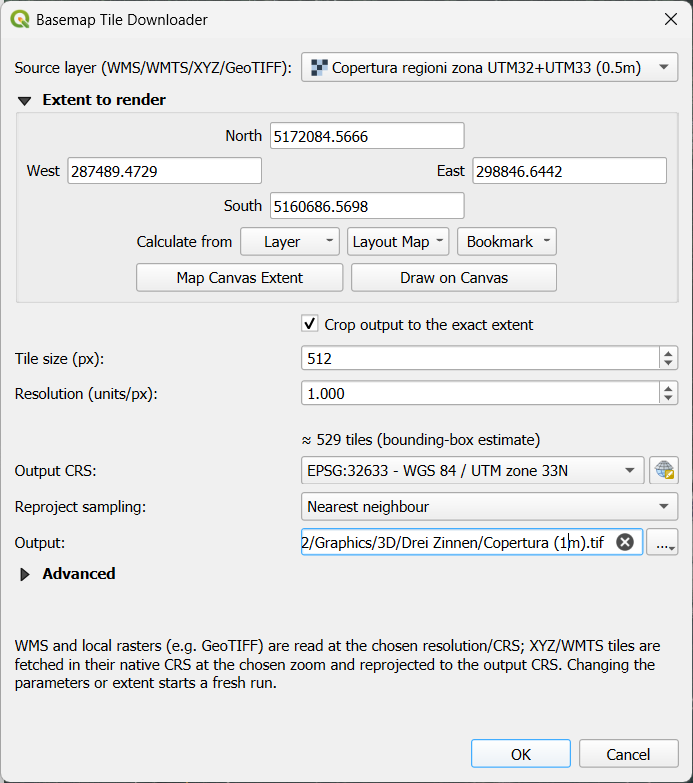

# Basemap Tile Downloader for QGIS

[](https://github.com/cvonk/qgis-basemap-tile-downloader/actions/workflows/ci.yml)

**Turn any online basemap into a georeferenced GeoTIFF of exactly the area you need.**

Point it at a **WMS**, **WMTS**, **WCS**, or **XYZ** service — or a **local raster**
already loaded in your project — draw an extent, and the plugin fetches, georeferences, and
mosaics the tiles into a single compressed, overview-tiled GeoTIFF, ready for your
map, your analysis, or your 3-D scene. Pull a 0.5 m orthophoto over one valley, or
clip a national 10 m DTM to your study area — you get just the pixels you want, at
the resolution you choose.

### What it does
- **Auto-detects the source** — WMS, WMTS, WCS, XYZ, ArcGIS REST MapServer, or a local GDAL raster; no need to tell it which.
- **Tiles your extent** — WMS `GetMap` / WCS `GetCoverage` / ArcGIS `export` at a chosen resolution, or XYZ/WMTS at a chosen zoom.
- **Downloads elevation data properly (WCS)** — a coverage service serves measured values, not pictures, so WCS requests are lossless, keep their native Float32 samples, and preserve the coverage's nodata. The published footprint is read up front, so tiles off the edge of the data are never requested.
- **Harmonises flight years (ArcGIS)** — for orthophoto services that mosaic several survey years, it can download each year and colour-match them along the seam, so the result has no year-boundary banding. Optional, off by default.
- **Plays nice with servers** — adaptive, per-source throttling and parallel fetches: fast when it can be, gentle when it must be.
- **Never loses work** — a resumable SQLite queue picks an interrupted run back up exactly where it left off, and the cache can be moved or backed up.
- **Skips redundant downloads** — overlapping jobs (XYZ/WMTS/WMS/WCS/ArcGIS) reuse tiles from a shared cache, sparing both time and your provider's quota.
- **Finishes clean** — a compressed, tiled GeoTIFF with overviews, optionally reprojected and cropped to the exact extent, loaded straight into your project. Single-band data (e.g. an elevation DTM — whether from WMS, WCS, or a local raster) keeps its nodata instead of gaining an alpha band, and a mostly-empty result is flagged so a source that has no data over your area doesn't pass unnoticed.

Requires the GDAL Python bindings (bundled with QGIS). Written for QGIS 3.40.8 and QGIS 4.2.

> **Note:** This plugin is intended for personal and educational use only. Bulk-downloading tiles may violate a provider's Terms of Service (e.g. Google, Bing, Esri). Make sure your intended use is permitted, and respect each provider's usage limits, before downloading.

## Native Installation

Install from QGIS using the Plugins > Manage and Install Plugins, and search for "Basemap Tile Downloader".

## Manual Installation

The installable plugin lives in the **`basemap_tile_downloader/`** sub-folder of
this repository (the repo root holds the README, licence and screenshots).

1. Copy the `basemap_tile_downloader` folder into your QGIS plugins folder.
   QGIS 4 uses a separate profile root from QGIS 3, so pick the one for your
   version:
   - QGIS 3: `$env:APPDATA\QGIS\QGIS3\profiles\default\python\plugins\`
   - QGIS 4: `$env:APPDATA\QGIS\QGIS4\profiles\default\python\plugins\`

   (On macOS/Linux the base is `~/.local/share/QGIS/QGIS3` or `…/QGIS4`.)
2. In QGIS, open **Plugins ▸ Manage and Install Plugins ▸ Installed**.
3. Check the box next to **Basemap Tile Downloader** to activate it.

The tool then appears under **Raster ▸ Basemap Tile Downloader…** and on the toolbar.

> If you are developing, run `sync.ps1` in the repo root (`pwsh -File sync.ps1`)
> to mirror this plugin into your QGIS plugins folder; pair it with the *Plugin
> Reloader* plugin. (The script finds any plugin package — a folder with a
> `metadata.txt` — under its own directory, so it also works from a parent
> folder holding several plugin repos.)

## Usage

### 1. Match the coordinate reference system

Set the project CRS to suit your source by clicking the EPSG code in the
bottom-right of the window. WMS and WCS are requested in that CRS (for WCS,
falling back to the coverage's native CRS if the service doesn't offer yours);
XYZ/WMTS tiles are
fetched in their native CRS (EPSG:3857 for XYZ) and reprojected to the output
CRS you pick in the dialog — or left in the native CRS if you choose **None**
for the resampling. (For example, **EPSG:32632** for an Italian UTM-32 source.)

### 2. Add the basemap

**WMS** — get the WMS URL from your provider, then
**Layer ▸ Data Source Manager ▸ WMS/WMTS ▸ New**:
  - **Name** – e.g. `Copertura regioni WMS`
  - **URL** – e.g. `http://wms.pcn.minambiente.it/ogc?map=/ms_ogc/WMS_v1.3/raster/ortofoto_colore_12.map`

  Connect and add the layer (e.g. *Ortofoto a colori anno 2012 ▸ Copertura …
  WGS84 - UTM32*).

**WMTS** — **Layer ▸ Data Source Manager ▸ WMS/WMTS ▸ New**, connect to the
service's `GetCapabilities` URL and add a WMTS layer / tile matrix set.

**XYZ** — **Layer ▸ Data Source Manager ▸ XYZ ▸ New**, give it a name and a
`{z}/{x}/{y}` URL template.

**WCS** — **Layer ▸ Data Source Manager ▸ WCS ▸ New**, give it the service URL
(for GeoServer, the `…/ows` or `…/wcs` endpoint), connect, and add a coverage.
WCS serves *data* rather than a rendered picture, so this is the right source for
elevation: a DTM comes back as Float32 metres with its nodata intact, not as a
grey image. The plugin requests **WCS 1.0.0** `GetCoverage`, whose bbox-plus-size
request maps directly onto the tile grid; services that also offer 1.1/2.0 still
answer 1.0.0.

**Local raster (GeoTIFF)** — just load the file in QGIS
(**Layer ▸ Add Layer ▸ Add Raster Layer…**). Any GDAL-readable raster works;
there is nothing to download, so the tool exports it over the chosen extent
(reprojecting/cropping as configured).

### 3. Export to GeoTIFF

Open **Raster ▸ Basemap Tile Downloader…**. Pick the source layer (the dialog shows
the fields for its type), choose the **extent to render**, then set the output.



The **Extent to render** selector works like QGIS's *Convert Map to Raster*
dialog — set it from the dropdown:
- **Calculate from Layer** – the bounding box of a layer,
- **Use Current Map Canvas Extent** – the current view,
- or type the min/max coordinates directly.

**WMS example**

| Setting | Example |
| --- | --- |
| Source layer | `Copertura regioni WMS` |
| Extent to render | Current map canvas extent |
| Tile size | `1024` |
| Resolution | `0.5` |
| Output CRS | `EPSG:32632` |
| Reproject sampling | `Bilinear` (or Nearest / Cubic / None) |
| Crop output to the exact extent | ☐ |
| Parallel downloads (Advanced) | `2` (lower for strict servers) |
| Output | `C:\Users\you\output.tif` (or a temporary file) |

**XYZ example**

| Setting | Example |
| --- | --- |
| Source layer | `OpenStreetMap` |
| Extent to render | Current map canvas extent |
| Zoom level | `18` (≈ 0.6 m/px) |
| Output CRS | `EPSG:32632` |
| Reproject sampling | `Bilinear` (or Nearest / Cubic / None) |
| Crop output to the exact extent | ☐ |
| Parallel downloads (Advanced) | `4` |
| Output | `C:\Users\you\output.tif` (or a temporary file) |

(A **WMTS** layer uses the same fields as XYZ — pick a **zoom level**.)

**WCS example** (elevation)

| Setting | Example |
| --- | --- |
| Source layer | `DTM Italy Bolzano WCS (2.5m)` |
| Extent to render | Calculate from Layer ▸ your AOI |
| Tile size | `1024` |
| Resolution | `2.5` (pre-filled from the coverage's native pixel size) |
| Output CRS | `EPSG:25832` |
| Reproject sampling | `None` (keep the measured values unresampled) |
| Crop output to the exact extent | ☑ |
| Parallel downloads (Advanced) | `2` |
| Output | `C:\Users\you\dtm_aoi.tif` |

A coverage tile is raw Float32, so it is far heavier per pixel than an image
tile — 1024² is ~4 MB on the wire. Drop the tile size (512) or coarsen the
resolution if a server is slow to answer. Asking for a resolution finer than the
coverage's native one only makes the server interpolate.

**Local raster (GeoTIFF) example**

| Setting | Example |
| --- | --- |
| Source layer | `DTM Italy (10m)` |
| Extent to render | Current map canvas extent |
| Tile size &amp; resolution | *greyed — exported at the raster's native resolution* |
| Output CRS | `EPSG:32632` |
| Reproject sampling | `Bilinear` (or Nearest / Cubic / None) |
| Crop output to the exact extent | ☑ |
| Output | `C:\Users\you\clip.tif` (or a temporary file) |

(A local raster is **read**, not downloaded, so it is exported at its native
resolution: the *Tile size &amp; resolution* group is collapsed and greyed, and so
are the *Advanced* options and the tile-count estimate — they only apply to a
network download. The QGIS Task Manager labels the run *"Basemap raster export"*.)

Notes:
- The dialog is organised into collapsible groups — **Extent to render** (with
  the *Crop to the exact extent* option), **Tile size &amp; resolution**, and
  **Output** — all open by default. **Every control has a hover tooltip** — point
  at a field for a fuller explanation than fits in its label.
- A live tile-count estimate updates as you adjust the settings — with the *Tile
  size &amp; resolution* controls for WMS/WCS/ArcGIS, or under the *Zoom level* for XYZ.
  With *Harmonise flight years* on, the estimate is **per flight year** (each
  year is fetched separately). Before a large download the dialog asks for
  confirmation (with a Terms-of-Service reminder): above about 5,000 estimated
  tiles, or for any WMTS export, whose count can't be predicted in advance.
- If the chosen **output file already exists**, the dialog asks before
  overwriting it.
- **Reproject sampling: None** keeps the mosaic in its native CRS (no
  reprojection, no resampling).
- **Crop output to the exact extent** trims the tile-aligned mosaic to the
  precise extent rectangle.
- The collapsible **Advanced** section holds the tuning knobs (**Reset to
  defaults** restores them; the whole section is greyed out for a local raster):
  - **Parallel downloads** — lower it (1–2) for strict servers that reject many
    simultaneous connections; WMS and WCS default to 2, XYZ/WMTS to 4.
  - **Maximum attempts per tile** — how many times a tile is retried before it is
    marked failed.
  - **Minimum delay between requests** (default 0 s) — a floor on the pace; raise
    it (e.g. 2 s) to pin a known-good rate for a strict server. At 0 the adaptive
    throttle sets the pace on its own.
  - **Back-off cap** (default 30 s) — the longest the adaptive throttle will wait
    between requests while a server is throttling/erroring. Lower it to retry
    sooner (more aggressive); raise it to be gentler.
  - **Give up after (server errors in a row)** (default 30) — stop the run when
    this many requests in a row fail with no success (a server refusing a block
    of tiles), keep what downloaded in the queue, and leave the rest for a re-run.
    Set it to 0 (“Never”) to keep only the per-tile limit.
  - **Bypass cached server errors on retry** (off by default) — for a WMS behind
    a cache/CDN. A WMS `ServiceException` is returned as a normal `200 OK`, so a
    cache can store that error and replay it for every identical retry, and the
    request never recovers. Tick this to make each retry add a throwaway
    parameter so the request differs and the server actually re-renders. Leave it
    off for normal use — it forgoes the cache on retries (more load), and only
    WMS and WCS are affected (XYZ/WMTS/local rasters ignore it).
- The collapsible **Processing** section (ArcGIS sources only, **closed by
  default**) holds **Harmonise flight years**. An ArcGIS orthophoto service often
  serves a mosaic of several survey years, with a visible colour seam where two
  years meet. When on, the plugin downloads each year separately and
  colour-matches the older years to the newest **along their shared boundary**,
  then composites — removing the seam while keeping each year's own colours (a
  global balance would mute them). Services with a deep dated archive (some go
  back decades) use only the newest few years.
- The mosaic is built **only when every tile is downloaded**. If you **cancel** a
  run, the server stops it early, or some tiles fail, no mosaic is produced —
  progress is checkpointed and **re-running continues** where it left off; the
  mosaic is built once the last tile lands.
- **Build mosaic even if some tiles are missing** (under *Output*, **off by
  default**) overrides that: it stitches a mosaic from whatever downloaded,
  leaving the missing tiles as transparent **gaps**. The queue is still
  checkpointed, so a later re-run **with this off** fills the gaps and rebuilds
  the mosaic complete. Handy for a quick look, or when a provider simply has no
  data for part of your extent and the run would otherwise never complete.

Click **OK** to start. A live per-tile counter appears in the message bar (e.g.
*Downloading tiles… 1,234 / 2,025 (61%) · ~3m 20s left*), overall progress shows in
the Task Manager, and the live run log opens in the **Log Messages** panel (the
*Basemap Tile Downloader* tab). The finished mosaic is added to the project
automatically. (Request URLs are logged with any API-key/token query values
masked, so sharing a `download.log` in a bug report can't leak a credential.)

## Q & A

**"Calculate from Layer" fills the extent with `NaN`.**
This usually means the CRS of the layer you picked for the extent doesn't line
up with the extent's CRS, so reprojecting its bounding box produces invalid
(`NaN`) coordinates. Reproject the layer you're using for the extent so its CRS
matches (right-click the layer ▸ **Export ▸ Save Features As…** and choose the
target CRS) — or, if its assigned CRS is simply wrong, fix it under the layer's
**Properties ▸ Source ▸ Assigned CRS**. Then pick the layer again.

**Does the extent (AOI) layer need the same CRS as the source layer?**
No. The extent is reprojected automatically: **Calculate from Layer** transforms
the AOI layer's bounding box into the project CRS, and the plugin then reprojects
that to whatever the source needs (EPSG:3857 for XYZ, the request CRS for WMS
and WCS, the tile-matrix-set CRS for WMTS, or the raster's CRS for a local
GeoTIFF). So
the AOI, the project, and the source can all be in different CRSs. The only real
requirement is that each layer's **assigned CRS is correct** — a *mislabelled*
AOI CRS is what produces a wrong or `NaN`/0 extent (see the previous entry).
Because the extent is a reprojected bounding box, for an oblique CRS it may be a
little larger than the tight box in the source CRS — harmless, just a few extra
edge tiles.

**Why is my map blurry?**
Check that the resolution / zoom and the coordinate reference systems suit your
source. For XYZ, requesting a zoom finer than the provider serves only
interpolates — it adds no real detail.

**The export finished, but the output is mostly empty / all nodata.**
Every tile can download successfully and the result still be blank over most of
the extent — because the provider simply publishes nothing there. For a
single-band coverage (e.g. a DTM), the run measures how much of the finished
mosaic actually carries data and **warns when most of it is nodata** (the
completion message and `download.log` report the percentage). Common causes: your
extent reaches past the edge of the source's coverage (a regional DTM that stops
at an administrative border), or the source raster you pointed at was itself only
partly written. It's expected, too, when your AOI *polygon* is much smaller than
its bounding box. If the warning is a surprise, check the source's real coverage
over your area before relying on the output.

**A run didn't finish — some tiles failed. What now?**
Tiles can fail from server-side rate-limiting/throttling or a transient server
error (the completion message and `download.log` report how many). The mosaic is
built **only when every tile is present**, so a run with failures produces no
output. **Just run the export again with the same settings** — it keeps the tiles
already downloaded and retries the failed ones; once they all succeed the mosaic
is built. (If you'd rather have a mosaic *now*, gaps and all, tick **Build mosaic
even if some tiles are missing** under *Output* — the missing tiles are left
transparent, and a later re-run with it off still fills them.) If a specific
server keeps failing many parallel requests, lower **Parallel downloads** (to
1–2). For XYZ, `404`/`204` tiles are *not* failures —
they're legitimate empty tiles (no data there), counted as done and left as
transparent areas in the finished mosaic; a resume won't re-request them, so it
doesn't waste a quota tile re-confirming known gaps.

If a server refuses a whole block of tiles and keeps failing every request, the
run **stops early** rather than grinding for hours (“Server unavailable — stopped
early…”) and defers the mosaic; what downloaded stays in the queue for a re-run.
You can tune when this kicks in with **Give up after** / **Back-off cap** in the
Advanced section (see above). Note the mosaic is only built once **every** tile is
present, so an interrupted or partially-failed run produces no output until you
re-run and it completes.

If the *same* tiles keep failing no matter how often you re-run, open
`download.log` (each export gets its own subfolder under `__btdcache__/`, next to
your project, named after the output file plus a short hash of its full path —
so same-named outputs in different folders keep separate caches) and read the
per-tile errors: the
service may simply not have data for that area. A WMS
`ServiceException` such as *"Unable to access file … tile_33_12.shp"*, or errors
confined to one part of the extent, usually mean the provider can't serve that
region — not a transient glitch, so retrying won't help. Often it is one
sublayer that either doesn't cover your whole extent or is **broken on the
server** for that area (e.g. an adjacent UTM-zone orthophoto whose backing file
the provider can't read). Note that a combined `LAYERS=a,b` request fails the
**whole** tile if *either* sublayer errors, so a single broken sublayer can
block tiles that another sublayer would happily cover. Two ways to finish:
- **Get a mosaic now, with holes:** tick **Build mosaic even if some tiles are
  missing** under *Output* and re-run — the stuck tiles are left as transparent
  gaps. Good when they fall off the useful area, or you just want a quick look.
- **Actually fill them:** recreate the WMS layer requesting only the **working**
  sublayer (drop the broken one), or shrink the extent to the covered region.
  Because the layer list is part of the job fingerprint, this starts a **fresh**
  download rather than resuming the existing one.

Either way, *re-running* means re-opening the dialog and clicking **OK** with the
same settings — you do **not** reload the plugin (that only matters when the
plugin's own code changes). Once the queue is complete, a re-run skips straight
to building the mosaic with no further downloads. Note the log is rewritten on
each run, so copy it before re-running if you want to keep the evidence.

**A server rate-limits me, or blocks me after a while.**
The adaptive throttle already backs off and retries, but for a strict server you
can ease it further: drop **Parallel downloads** to 1 and raise **Minimum delay**
(e.g. 2–8 s) in the Advanced section. If a provider enforces a **daily quota**
(everything works, then stops for the day), no pacing beats it — spread the work
across days: run until it stops, then **re-run the next day** and it continues
where it left off (the resumable per-job cache picks up the pending tiles).

**How much disk is the cache using, and how do I reclaim it?**
The bottom of the dialog shows the current total, e.g. *Download cache: 19.1 GB
(2 exports, shared tiles 762.7 MB)*. It is measured in the background, so the
dialog opens instantly even when the cache holds tens of thousands of tiles, and
the figure fills in as the scan proceeds. Hover it for the full path, the file
count, and a **largest-folders breakdown** — the quickest way to see which export
(or leftover folder) is actually holding the space. **Clear cache…** next to it
deletes the whole `__btdcache__` folder after a confirmation that repeats the
size and breakdown. GeoTIFFs you have already exported are untouched; what you
lose is the ability to resume any interrupted download, and the shared tiles that
overlapping areas were reusing (so re-downloading them counts against the
provider's quota again). It refuses to run while a download is in progress, and
if a file is locked by another QGIS instance it deletes the rest and tells you
what it skipped.

**Can I move, back up, or restore the download cache?**
Yes — move the **whole `__btdcache__/` folder** (next to your project). It holds
one subfolder per export (the SQLite queue) plus a shared `shared/` tile store
that XYZ/WMTS/WMS/WCS/ArcGIS jobs fetch into. Tiles are cached as
DEFLATE-compressed GeoTIFFs to keep the cache compact; once you're happy with an
output you can delete its subfolder (or the whole `__btdcache__/`) to reclaim
the space — you only lose the ability to resume/re-use those tiles. Paths are stored *relative* to `__btdcache__/`,
so you can move, copy, or restore the whole folder to another drive or machine and
a re-run with the same settings resumes without re-downloading. Moving just a
single job's subfolder isn't enough now that the tile images live in `shared/` —
take the whole `__btdcache__/`. (Caches from before this feature stored absolute
paths; those still work in place, but moving them re-fetches their tiles.)

**I download overlapping areas — can it reuse tiles between them?**
Yes, for **XYZ**, **WMTS**, **WMS**, **WCS** and **ArcGIS** sources. Their tiles
have a fixed global identity (`{z}/{x}/{y}` for XYZ, matrix/col/row for WMTS,
and — because the grid is anchored to the CRS origin — global col/row for WMS,
WCS and ArcGIS), so a tile one area already fetched is reused by any overlapping
area at
the same settings: no repeat request, and no hit against the provider's quota.
These shared tiles live in `__btdcache__/shared/<source>/`, separate from the
per-job folders and keyed by the source so different providers or settings never
mix (for WMS the key covers the endpoint, layers, styles, CRS, format,
resolution and tile size — change any and it's a different set; for WCS the
endpoint, coverage, CRS, format, resolution and tile size; ArcGIS likewise,
with each layer / flight year cached separately). Delete that `shared/` folder to clear it (e.g. if a
provider refreshes its imagery). A local GeoTIFF isn't downloaded, so nothing is
cached for it. Note WMS tiles now align to the CRS origin rather than the
extent's corner, so overlapping WMS exports share a pixel grid; the exact-extent
crop still trims the final mosaic, so the output isn't enlarged.

**A run failed with a WMS `ServiceException` about a file it can't open.**
That's the *provider's* server failing to read its own data (often intermittent
— e.g. it briefly can't reach the storage behind a sublayer) — not a plugin or
network problem on your side. There's a catch that used to make this look
permanent: the server returns that error as a normal `200 OK` response, so a
caching layer in front of it (CDN/proxy) can cache the *error* and replay it for
every byte-identical request — a plain retry to the exact same tile would then
keep getting the stale failure, and only changing a request-shaping setting
(tile size, resolution, extent) broke through, by accident of altering the
request. If you hit this, tick **Bypass cached server errors on retry** in the
*Advanced* section (off by default) and re-run: each retry then adds a throwaway
cache-buster to the GetMap request so the server actually re-renders instead of
replaying the cached error. Leave it off for normal use — it forgoes the cache on
retries (more load) and only affects WMS. Either way, once the file is readable
again the run recovers; if a whole batch is affected, wait a bit and re-run.

**Can I export a local GeoTIFF instead of downloading?**
Yes. Load any GDAL-readable raster in QGIS and pick it as the source layer. There
is nothing to download — the raster is read over the chosen extent and run
through the same reproject / crop / mosaic pipeline. Use it to clip, reproject,
or resample a raster to a new GeoTIFF. (A clip may look brighter than the source
in QGIS: that's QGIS recomputing its contrast stretch over the smaller value
range, not a change in the data — match the layers' Min/Max in Symbology to
compare.)

**Which version of QGIS is this for?**
It was written for QGIS 3.40.8 and also runs on QGIS 4.2.0. The same package
works on both Qt 5 (QGIS 3.40+) and Qt 6 (QGIS 4).

**Can I run it from the QGIS Python Console?**
Yes — the source backend is auto-detected from the layer you pass:

```python
from basemap_tile_downloader import engine
from qgis.core import QgsProject
from qgis.utils import iface

wms = QgsProject.instance().mapLayersByName("Copertura regioni WMS")[0]

extent = iface.mapCanvas().extent()               # any QgsRectangle
extent_crs = QgsProject.instance().crs().authid()

# WMS / local raster: opts = {tile_pixels, resolution};  XYZ/WMTS: opts = {zoom}
engine.run(layer=wms, extent=extent, extent_crs=extent_crs,
           opts={"tile_pixels": 1024, "resolution": 0.5},
           out_crs="EPSG:32632",
           resample="bilinear",            # near | bilinear | cubic | none
           clip=True,                      # crop to the exact extent
           concurrency=2,                  # parallel tile fetches
           min_delay=0,                    # floor (s) on the pace; 0 = adaptive
           backoff_cap=30,                 # s; adaptive back-off ceiling
           giveup_after=30,                # consecutive failures → stop; 0 = never
           output_path=r"C:\Users\you\output.tif")  # or temporary=True for a temp file
```

## Licence


See [LICENSE](LICENSE).
